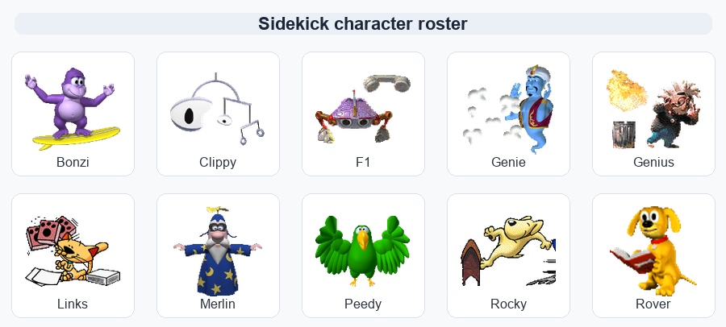

# Sidekick

<p align="center">
  
</p>

<p align="center">
  Native macOS Sidekick: a visible desktop assistant with selectable animated
  characters, local CLI brains, voice input, screen grounding, and computer-use
  tools.
</p>

<p align="center">
  <a href="https://github.com/companion-inc/sidekick/actions/workflows/ci.yml"></a>
  <a href="https://github.com/companion-inc/sidekick/releases/latest"></a>
  <a href="LICENSE"></a>
</p>

<p align="center">
  <a href="https://github.com/companion-inc/sidekick/releases/latest/download/Sidekick.dmg"><strong>Download for macOS</strong></a>
  ·
  <a href="https://github.com/companion-inc/sidekick/releases/latest">Latest release</a>
  ·
  <a href="Docs/STATUS.md">Status</a>
  ·
  <a href="Docs/Handbook/README.md">Handbook</a>
</p>

## What Sidekick Does

Sidekick is a native Swift macOS app that keeps one selectable animated
character on screen. The app is Sidekick; Clippy is one bundled character, not
the product name or the whole cast. Pick Bonzi, Clippy, F1, Genie, Genius,
Links, Merlin, Peedy, Rocky, or Rover, then click the character or use the
command channel to chat, press `Control+Space` to type from anywhere, use the
menu-bar eye or right-click the character for the retro control menu, hold
`Control+Option` to talk, and let the assistant point at or operate the desktop
through bundled local tools.

The product path is local-first:

- The visible app, speech bubble, permissions UI, annotation overlay, character
  renderer, and app packaging live in this repository.
- The assistant brain runs through locally installed ChatGPT or Claude
  connectors. Existing local OpenAI/Anthropic API keys are offered in setup when
  account sign-in is not set up.
- First launch runs guided setup in Sidekick's own speech bubble: choose ChatGPT
  or Claude, accept or replace discovered API keys, and grant Mac permissions.
- Voice input uses Deepgram when `DEEPGRAM_API_KEY` is configured, with the
  Apple speech stack as the local fallback. Spoken replies use xAI TTS.
- Computer-use calls run through the Sidekick-bundled Cua helper in packaged
  builds.
- Record & Replay uses a Sidekick-owned local Chronicle recorder to save
  workflow evidence under `~/Library/Application Support/Sidekick/Chronicle`,
  then asks the Codex brain to turn the resulting event stream into a reusable
  skill.

## Characters

The committed character packs live under `Resources/Characters`. Each pack has a
sprite atlas, a `character.json` animation definition, and a generated
`manifest.json` with its animation count.

| Character | Pack | Example animations available in this repo |
| --- | --- | --- |
| Bonzi | [`Resources/Characters/Bonzi`](Resources/Characters/Bonzi) | 73 animations, including `Greet`, `GetAttention`, `DoMagic1`, `Read`, `Write`, and `Wave` |
| Clippy | [`Resources/Characters/Clippy`](Resources/Characters/Clippy) | 43 animations, including `Greeting`, `GetAttention`, `IdleAtom`, `EmptyTrash`, `Save`, and `SendMail` |
| F1 | [`Resources/Characters/F1`](Resources/Characters/F1) | 48 animations, including `Greeting`, `IdleCuteToeTwist`, `IdleFallsAsleep`, `Thinking`, `Save`, and `SendMail` |
| Genie | [`Resources/Characters/Genie`](Resources/Characters/Genie) | 76 animations, including `Greet`, `DoMagic1`, `Hearing_4`, `Read`, `Write`, and `Wave` |
| Genius | [`Resources/Characters/Genius`](Resources/Characters/Genius) | 47 animations, including `Greeting`, `DeepIdle1`, `GetWizardy`, `Print`, `Thinking`, and `Writing` |
| Links | [`Resources/Characters/Links`](Resources/Characters/Links) | 50 animations, including `Greeting`, `IdleTailWagA`, `IdleYawn`, `IdleButterFly`, `Thinking`, and `SendMail` |
| Merlin | [`Resources/Characters/Merlin`](Resources/Characters/Merlin) | 73 animations, including `Greet`, `DoMagic2`, `Thinking`, `Search`, `Write`, and `Wave` |
| Peedy | [`Resources/Characters/Peedy`](Resources/Characters/Peedy) | 85 animations, including `Greet`, `Blink`, `LookUpRightBlink`, `Read`, `Write`, and `Wave` |
| Rocky | [`Resources/Characters/Rocky`](Resources/Characters/Rocky) | 46 animations, including `Greeting`, `DeepIdle1`, `Idle(1)`, `GetTechy`, `Print`, and `Writing` |
| Rover | [`Resources/Characters/Rover`](Resources/Characters/Rover) | 29 animations, including `Greet`, `Books`, `Cooking`, `ImageSearching`, `Sports`, and `Travel` |

## Download

Download the current macOS build:

```text
https://github.com/companion-inc/sidekick/releases/latest/download/Sidekick.dmg
```

Open the DMG, drag `Sidekick.app` into Applications, and launch it. When macOS
blocks the first launch of a locally signed build, Control-click `Sidekick.app`,
choose `Open`, and approve the prompt once.

Sidekick checks for signed updates automatically in the background. You can also
open the Sidekick menu and choose **Check for Updates...**.

Sidekick asks for permissions only when the relevant feature needs them:

- Microphone for push-to-talk voice input.
- Screen Recording for screen grounding and pointing.
- Full Disk Access for local app databases.
- Accessibility for computer-use actions you approve.

## Requirements

- macOS 13 or newer.
- One local account connector signed in, or installed with its matching local API key:
  - Claude through `claude`.
  - ChatGPT through `codex`.
- Optional: `DEEPGRAM_API_KEY` for streaming speech-to-text.
- Optional: `XAI_API_KEY` for spoken replies.
- Optional: Accessibility permission for recording mouse/key workflow events
  during Record & Replay.

API keys can be supplied through the environment, Iris local settings,
Sidekick's `Configure API Key...` screen for voice keys, or this local file:

```text
~/Library/Application Support/Sidekick/Secrets.json
```

```json
{
  "anthropicAPIKey": "...",
  "openAIAPIKey": "...",
  "sttAPIKey": "...",
  "ttsAPIKey": "..."
}
```

## Build From Source

```sh
swift test
swift build
```

To build the Launch Services app wrapper:

```sh
Scripts/package-sidekick-app.sh release
open -n .build/release/Sidekick.app
```

`Scripts/package-sidekick-app.sh` requires a `cua-driver` binary so packaged
computer-use tools can run from inside `Sidekick.app`. Set `SIDEKICK_CUA_DRIVER` to
an existing binary, or install the Cua driver in one of the script's default
locations.

## Developer Commands

The running app listens for optional debug commands through `SIDEKICK_CMD_FILE`:

```text
ask:<message>
sidekick:clippy|bonzi|f1|genie|genius|links|merlin|peedy|rocky|rover
open
hide
show
snapshot
move:<x>,<y>
park:lowerLeft|lowerRight|upperLeft|upperRight
state:idle|thinking|working|notification|attention|error|sweeping|carrying|juggling|sleeping
```

## Repository Layout

- `Sources/Sidekick` - macOS application entry point.
- `Sources/SidekickCore` - character rendering, voice, local brain adapters,
  computer-use routing, permissions, windows, and runtime logic.
- `Sources/SidekickMCP` - helper MCP server for Sidekick-owned annotations.
- `Resources/Characters/*` - committed sidekick sprite packs and animation manifests.
- `Resources/Sidekick.icns` - app icon.
- `Scripts` - packaging and asset export scripts.
- `Docs` - implementation status, architecture notes, verification matrix, and
  research handbook.

## Release Process

Every push to `main` runs tests and packages the macOS app. Tagged pushes that
start with `v` publish GitHub Release assets:

- `Sidekick.dmg`
- `Sidekick.dmg.sha256`
- `Sidekick-macOS.zip`
- `Sidekick-macOS.zip.sha256`
- `SHA256SUMS.txt`
- `Sidekick-macOS.notarization.txt`
- `appcast.xml` for Sparkle OTA updates

## Contributing

Start with [CONTRIBUTING.md](CONTRIBUTING.md). For architecture context, read
[Docs/STATUS.md](Docs/STATUS.md) and [Docs/Handbook/README.md](Docs/Handbook/README.md)
before changing runtime behavior.

## License

Sidekick is released under the [MIT License](LICENSE).
